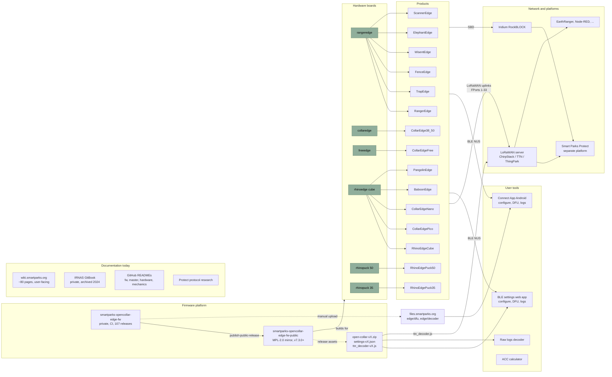

# OpenCollar Documentation Hub: Discovery Report and Implementation Plan

Date: 2026-09-24. Scope: discovery only. Nothing was built, installed, committed or pushed. All repositories outside `~/apps/opencollar` were inspected read-only (GitHub API for 50 org repositories, local clones of `ble-settings-app` and `raw_logs_decoder`, the Smart Parks Wiki, the private IRNAS GitBook archive, files.smartparks.org, smartparks.org).

Legend for status: **current** = actively released or sold, **maintained** = works but rarely changes, **legacy** = superseded, **experimental** = R&D, **unknown** = could not be established with confidence.

---

## Executive summary

1. **The ecosystem is one firmware platform + many device packagings.** A single Zephyr/nRF Connect SDK firmware (`smartparks-opencollar-edge-fw`, private, v8.0.1 released today) targets 6 hardware boards (`collaredge`, `freeedge`, `rangeredge`, `rhinoedge`, `rhinopuck`, `rhinopuck35`, plus a special `rangeredge_airq` build) and 16 "tracker types" selectable by a setting. Every product name (RangerEdge, WisentEdge, ElephantEdge, FenceEdge, TrapEdge, CollarEdge Pico/Nano/38/50/Free, RhinoEdge Cube/Puck, HorseEdge, BaboonEdge, PangolinEdge, ScannerEdge) maps onto one of those boards.
2. **The public firmware mirror exists since April 2026** (`smartparks-opencollar-edge-fw-public`, MPL-2.0, releases v7.3.0, v8.0.0, v8.0.1 with binaries, `settings-vX.json` and `ttn_decoder-vX.js`). Older release assets only exist in the private repo and on files.smartparks.org.
3. **Documentation is spread over 6 places with no index**: the Smart Parks Wiki (about 80 OpenCollar pages, user-facing, partly stale, and its TLS certificate is expired today), GitHub READMEs (developer-facing, strong), a private IRNAS GitBook (archived 2024, still linked from the public firmware README), files.smartparks.org (DFU zips and decoders), the smartparks.org catalog, and the Smart Parks Protect repo (a 4,000-line protocol research document that is currently the most complete protocol reference anywhere).
4. **Three deployed web tools already exist and should headline the hub**: the BLE settings app (configure, update firmware over DFU, download logs), the raw logs decoder, and the accelerometer calculator. The Android Connect App (Play Store, private source) is the fourth user-facing tool. The older Toolset and Connect-Web are legacy.
5. **Recommended stack: MkDocs Material on GitHub Pages**, with two YAML data files (`repositories.yml`, `devices.yml`) rendered into pages by a small macro plugin, and one scheduled GitHub Action that refreshes release metadata. No backend.
6. **Biggest quick wins are not the website**: fix 40+ stale `github.com/IRNAS/...` links in the master repos, point the public firmware README at public docs instead of the private GitBook, enable Issues on the public firmware repo, add licenses to 30 repos that have none, and renew the wiki certificate.

---

## A. Repository inventory

The organization has 50 repositories (43 public, 7 private). 40 relate to OpenCollar. Grouped by role:

### A1. Firmware

| Repository | Purpose | Status | Devices | Docs / releases | Relationships |
|---|---|---|---|---|---|
| `smartparks-opencollar-edge-fw` (private, C) | Canonical firmware development repo. CI builds, `create-release`, `publish-public-release` workflows. 107 releases, v0.1 (2020-09) to v8.0.1 (2026-09-24). | current | all Edge devices | README (build/flash/provisioning/tracker types), CHANGELOG (Keep a Changelog), 20+ module READMEs, `scripts/settings/settings.json`, `scripts/ttn_decoder.js` | Source of truth. Snapshot + assets pushed to the public repo per release. |
| `smartparks-opencollar-edge-fw-public` (MPL-2.0) | Public mirror: sanitized snapshot per release (no `.github`), release assets copied. Releases v7.3.0, v8.0.0, v8.0.1. | current | all Edge devices | Same README/CHANGELOG as private. Assets per release: `open-collar-vX.zip`, `-debug.zip`, `-prov.zip`, `air-quality-vX.zip`, `samples-vX.zip`, `settings-vX.json`, `ttn_decoder-vX.js` | Issues **disabled**; README links to private GitBook and `github.com/IRNAS/...` (404). Build requires 10 IRNAS west modules, all public under `github.com/irnas`. |
| `smartparks-opencollar-edge-fw-old-backup` (private) | Backup of firmware history up to v6.12.1 (2025-03). | legacy | — | — | Archive candidate. Not referenced anywhere. |

Firmware facts verified from source: NCS 2.2 / Zephyr 3.2.99-ncs1; MCUboot DFU; LoRaWAN via Semtech LR11xx (SWL2001/SWDR001 Zephyr ports); u-blox GNSS; LIS2DW12 accelerometer; EN25 SPI flash log store; Nordic UART Service for BLE; optional RockBLOCK (Iridium), T5838/VM3011 microphones, BMV080/BME690 air quality, fence port, external switch, LP0 (LoRa without LoRaWAN stack, experimental offload). Settings/commands/messages/ports are all generated from one `settings.json` (v8.0.1: 123 settings, 46 commands, 20 values, 27 messages, 28 FPorts). v8.0.0 introduced a settings *family* byte (breaking wire-format change for FPort 3 and BLE settings; commands unchanged).

### A2. Device "master" repositories (documentation only: README, BOM.md, ASM.md, CHANGELOG.md, photos)

| Repository | Device | Status | Notes |
|---|---|---|---|
| `smartparks-collaredge_38mm_50mm-master` | CollarEdge 38mm / 50mm | current (v1.0.0, 2025-10) | Links already updated to SmartParksOrg. Best-maintained master. |
| `smartparks-collaredge_free-master` | CollarEdge Free (Iridium) | current (no release yet, pushed 2026-04) | Links updated to SmartParksOrg. |
| `smartparks-collaredge_pico-master` | CollarEdge Pico | current (v0.1.0) | Uses RhinoEdge Cube electronics. Links to IRNAS (stale). |
| `smartparks-rangeredge-master` | RangerEdge | current (v1.0.0) | Only master repo with LICENSE files (CERN-OHL-W-2.0 hardware, MPL-2.0 firmware, CC-BY-SA-4.0 docs) and a trademark notice. Links to IRNAS (stale). |
| `smartparks-wisentedge-master` | WisentEdge | current (v1.0.0) | RangerEdge electronics in POM/aluminium housing. Links to IRNAS. |
| `smartparks-elephantedge-master` | ElephantEdge | current (v1.0.0) | RangerEdge electronics + battery pack board. Links to IRNAS. |
| `smartparks-rhinoedge_cube-master` | RhinoEdge Cube | current (v1.0.0) | Links to IRNAS. |
| `smartparks-rhinoedge_puck35-master` | RhinoEdge Puck35 (wiki/catalog call it "Puck 34") | current (v1.0.0) | Links to IRNAS. |
| `smartparks-rhinoedge_puck50-master` | RhinoEdge Puck50 | current (v1.0.0) | Links to IRNAS. |
| `smartparks-fence_monitor-master` | Fence Monitor / FenceEdge | current (v1.0.0) | RangerEdge + fence monitor board. Links to IRNAS. |

All ten share one IRNAS template (same `.github` workflows, same README skeleton). Seven still link to `github.com/IRNAS/smartparks-*`; public ones 301-redirect, the private ones (firmware, connect-app, provisioning) return 404 to the public. Several READMEs contain placeholder values ("Weight: x g").

### A3. Electronics hardware (Altium projects, release zips FAB / PCBA / SRC)

| Repository | Board (firmware name) | Latest | Releases | Notes |
|---|---|---|---|---|
| `smartparks-collaredge-hardware` | `collaredge_nrf52840` | v1.7.1 (2025-12) | 19 | Variants incl. "BuoyFish production" (non-wildlife use). Default branch `master`. |
| `smartparks-rangeredge-hardware` | `rangeredge_nrf52840` | V1.13.1 (2025-12) | 27 | Most active hardware line. Variants BASIC/PROTECT(?)/external antenna. Default branch `master`. 1 open issue. |
| `smartparks-freeedge-hardware` | `freeedge_nrf52840` | V1.4.1 (2025-04) | 8 | Has RockBLOCK schematic sheet. Assets are named `collaredge_free-hardware` (naming drift). |
| `smartparks-rhinoedge_cube-hardware` | `rhinoedge_nrf52840` | V1.6.0 (2025-04) | 4 | README title says "RangerEdge Tracker" (copy-paste error). Release assets named `rhinoedge-hardware`. |
| `smartparks-rhinoedge_puck35-hardware` | `rhinopuck35_nrf52840` | V1.2.0 (2023-06) | 3 | |
| `smartparks-rhinoedge_puck50-hardware` | `rhinopuck_nrf52840` | V1.3.0 (2024-07) | 3 | |
| `smartparks-elephantedge_battery_pack-hardware` | (accessory) | V3.2.0 (2024-07) | 5 | |
| `smartparks-fence_monitor-hardware` | (accessory to RangerEdge) | V2.1.0 (2023-06) | 2 | |

Hardware changelogs live in the README, not in CHANGELOG.md. Altium 365 viewer links are present in every README (require login). No `rangeredge_airq` / "firewatch" extension board repo exists in the org (referenced by the firmware README; **unknown** where it lives, probably IRNAS).

### A4. Mechanics (STEP / STL / DXF / PDF)

`smartparks-collaredge_38mm_50mm-mechanics` (v1.2.0, 2026-03), `smartparks-collaredge_free-mechanics` (no release), `smartparks-wisentedge-mechanics` (v1.1.0, 2026-03), `smartparks-rangeredge-mechanics` (v1.0.0; also contains fence monitor housing), `smartparks-elephantedge-mechanics`, `smartparks-collaredge_pico-mechanics`, `smartparks-rhinoedge_cube-mechanics`, `smartparks-rhinoedge_puck35-mechanics`, `smartparks-rhinoedge_puck50-mechanics` (all v1.x, 2024-07). Consistent structure: README with material/dimensions/weight, `files/`, CHANGELOG. Six still link to IRNAS.

### A5. User-facing tools and applications

| Repository | What it is | Deployed at | Status | License |
|---|---|---|---|---|
| `ble-settings-app` | Web Bluetooth app: connect to a collar, read/write all settings (schemas bundled for fw 4.4.2 to 8.0.0), send commands, download flash logs, live map, messenger, **DFU over MCUmgr with bundled firmware binaries** (v4.4.3, v5.0.1 migration, v6.15.3, v7.1.0, v7.2.0, AirQ), HEX composer, PWA. Wiki calls it "Smart Parks Connect - ShortRange". | https://smartparksorg.github.io/ble-settings-app/ (Pages workflow) | current (v8 support committed 2026-09-21, not yet verified on hardware) | GPL-3.0 |
| `raw_logs_decoder` | Web app: decode raw log files exported from a device (base64/hex frames per line) with bundled `ttn_decoder` versions (6.11.2, 6.14.0, 6.15.1, 7.2.0) or a custom decoder; export CSV/JSON/XLSX; charts; map. App version v1.43. | https://smartparksorg.github.io/raw_logs_decoder/ (legacy Pages) | current | MIT |
| `opencollar-acc-calculator` | React/Vite calculator: LIS2DW12 + nRF52 duty cycle, flash and payload sizing for a *planned* accelerometer summary message (design study; not in firmware). | https://smartparksorg.github.io/opencollar-acc-calculator/ | maintained / experimental | MIT |
| `smartparks-connect-app` (private) | Android app (React Native): BLE configure, logs, DFU from phone or from `files.smartparks.org/edge/dfu/latest`. 59 releases, v2.13.0 (2026-05), APK attached to releases, on Google Play. | Play Store `com.smartparks_connect_app` | current | GPL-3.0 (private source) |
| `smartparks-toolset` | Static site: battery calculator, LoRaWAN decoder app, encoder app. Holds legacy gen-1 decoders and Edge ChirpStack-v4 decoders up to v6.5.0. Last change 2024-07. | https://toolset.smartparks.org/ | legacy / maintained | MIT |
| `smartparks-connect-web` | Go + Vue app to send settings/commands via ChirpStack v3 gRPC and RockBLOCK. Settings templates 2.10 / 2.15 / 3.2. Last change 2023-12. | https://connect.smartparks.org (wiki) | legacy | GPL-3.0 |
| `smartparks-lp0-replay-app` | Flask app: replay/decrypt/decode Semtech UDP JSONL logs (LP0 offload testing). | local / Docker | maintained, developer | MIT |
| `smartparks-lp0-platform` | Greenfield FastAPI/React rebuild of the replay app. WIP (2026-01). | — | experimental | MIT |
| `arduino-ble-accelerometer` | Arduino Nano 33 BLE accelerometer streamer + browser viewer with a rhino behaviour classifier. Research companion to the acc calculator. | https://smartparksorg.github.io/arduino-ble-accelerometer/ | experimental | none |
| `smartparks-provisioning-software` (private) | Provisioning rack software (Raspberry Pi, nrfjprog, barcode scanner); ships provisioning hex files v4.x. | — | current, internal | none |

### A6. LoRaWAN / integration / platform (adjacent, not OpenCollar-owned)

| Repository | Relevance | Status |
|---|---|---|
| `smartparks-protect` | Separate platform. Contains the OpenCollar device driver, `docs/devices/opencollar-protocol-research.md` (4,171 lines, the most complete protocol description that exists), `opencollar-webble.md`, `raw-log-files.md`, golden test fixtures and decoder copies. | current; **stays outside the hub**, linked as "integration" |
| `lorawan-devices` (fork of TTN device repo) | `vendor/smart-parks/opencollar*` = first-generation OpenCollar (fw 2.6, 2021). No Edge entry. | legacy |
| `lorawan-device-profiles` (fork of ChirpStack profiles) | No Smart Parks entry at all. | unrelated placeholder |
| `node-red-contrib-chirpstack`, `node-red-contrib-earthranger` | Node-RED nodes for the Smart Parks stack. Not OpenCollar-specific. | maintained (2022/2023) |
| `wildlifenl_smartparks_app` | Queries WildlifeNL data platform. | unrelated |
| `smartparks-connect` (private, Streamlit), `battery-calculator` (private, marked INACTIVE), `node-red-software` (private, one flows.json) | Superseded or unknown. | legacy / unknown |
| `AddaxAI-Connect`, `beuker-bokaal-app` (local only) | Not in the org listing / unrelated. | excluded |
| `opencollar` | This repository. Empty, public, description set, Issues and wiki enabled. | target |

---

## B. Device inventory

### B1. Hardware boards known to the firmware (v8.0.1)

| Firmware board | Hardware repo | HW revisions supported (revision groups) | Hardware type code |
|---|---|---|---|
| `collaredge_nrf52840` | collaredge-hardware | 1.0.0; 1.1.0–1.3.0; 1.4.0–1.7.0 (+1.5.0 board files) | 8 |
| `freeedge_nrf52840` | freeedge-hardware | 1.0.0–1.2.0; 1.3.0–1.5.0; 1.6.0; 1.7.0 (added v8.0.0) | 9 |
| `rangeredge_nrf52840` | rangeredge-hardware | 1.4.0–1.5.0; 1.6.0; 1.7.0; 1.8.0–1.13.0 | 5 |
| `rangeredge_airq_nrf52840` | (extension board not in org) | same as rangeredge | 5 (treated as rangeredge) |
| `rhinoedge_nrf52840` | rhinoedge_cube-hardware | 1.4.0–1.6.0 | 1 |
| `rhinopuck_nrf52840` | rhinoedge_puck50-hardware | 1.3.0 | 6 |
| `rhinopuck35_nrf52840` | rhinoedge_puck35-hardware | 1.2.0 | 7 |

Obsolete boards (existed in firmware 0.2–1.9, 2021): `elephantedge_nrf52840`, `wisentedge_nrf52840`, `cattracker_nrf52840`, `nrf52840dk`. Since v2.x ElephantEdge and WisentEdge are RangerEdge hardware with a different tracker type.

### B2. Product-to-component map

"Config" = configuration tools (all devices: Connect App, BLE web app, LoRaWAN downlinks). "Decoder" = firmware `ttn_decoder.js` of the matching firmware version (all Edge devices share one decoder family). Only the device-specific columns are listed.

| Product (wiki / catalog name) | Firmware board + tracker type | Electronics | Mechanics | Master docs | Wiki | Status | Confidence |
|---|---|---|---|---|---|---|---|
| RangerEdge | rangeredge, type 5 | rangeredge-hardware | rangeredge-mechanics | rangeredge-master | datasheet, settings, charging, production | current, sold | high |
| TrapEdge | rangeredge, type 5 + external switch settings | rangeredge-hardware | rangeredge-mechanics | (none) | trapedge | current (wiki 2026-07) | high |
| FenceEdge / Fence Monitor | rangeredge, type 10 | rangeredge-hardware + fence_monitor-hardware | rangeredge-mechanics (fence housing) | fence_monitor-master | fenceedge (+datasheet, settings, charging, compatibility) | current, sold | high |
| ScannerEdge / ScannerFree | rangeredge, type 7 (wiki says "separate firmware version", built with Hack the Planet) | rangeredge-hardware (+RockBLOCK for Free) | ? | (none) | scanneredge, scannerfree | current, sold | medium; firmware packaging **unknown** |
| WisentEdge | rangeredge, type 3 | rangeredge-hardware | wisentedge-mechanics | wisentedge-master | WisentEdge (+datasheet, settings) | current, sold | high |
| ElephantEdge / ElephantFree | rangeredge, type 2 (+RockBLOCK for Free) | rangeredge-hardware + elephantedge_battery_pack-hardware | elephantedge-mechanics | elephantedge-master | ElephantEdge (+datasheet, settings, counterweight), ElephantFree | current, sold | high |
| RangerEdge AirQ | rangeredge_airq special build | extension board (not in org) | ? | (none) | (none) | experimental | low |
| CollarEdge 38mm-1D / 38mm-2D / 50mm-2D (and HippoEdge 38-1D) | collaredge, type 8 | collaredge-hardware | collaredge_38mm_50mm-mechanics | collaredge_38mm_50mm-master | collaredge, 38-1D, 50-2D, datasheets, hippoedge | current, sold | high |
| CollarEdge Free (50mm-3D, Iridium) | freeedge, type 9 | freeedge-hardware | collaredge_free-mechanics | collaredge_free-master | collaredge/free (+datasheet) | current, sold | high |
| CollarEdge Pico 16-1A / 22-1C | rhinoedge, type 12 | rhinoedge_cube-hardware | collaredge_pico-mechanics | collaredge_pico-master | pico-16-1A, pico-22-1C (+datasheets) | current, sold | high |
| CollarEdge Nano 38-1C / 38-1D | rhinoedge, type 13 (wiki: "same PCB as RhinoEdge Cube") | rhinoedge_cube-hardware | **no repo found** | **no repo found** | nano-38-1C, nano-38-1D | current, sold | medium |
| CollarEdge 16mm (legacy) | ? | ? | ? | (none) | collaredge/16mm/datasheet | legacy | low |
| RhinoEdge Cube | rhinoedge, type 1 | rhinoedge_cube-hardware | rhinoedge_cube-mechanics | rhinoedge_cube-master | rhinoedge_cube (+datasheet, deployment, settings) | current, sold | high |
| RhinoEdge Puck 34 / Puck35 | rhinopuck35, type 6 | rhinoedge_puck35-hardware | rhinoedge_puck35-mechanics | rhinoedge_puck35-master | rhinoedge_puck_34 | current, sold (naming inconsistent) | high |
| RhinoEdge Puck 50 | rhinopuck, type 6 | rhinoedge_puck50-hardware | rhinoedge_puck50-mechanics | rhinoedge_puck50-master | rhinoedge_puck_50 | current, sold | high |
| HorseEdge | firmware: type 11 on rhinoedge board; wiki: RhinoEdge Puck 50 attached to the mane | rhinoedge or rhinopuck | none | none | HorseEdge | experimental (R&D stage 1), sold | **conflicting sources** |
| BaboonEdge | rhinoedge, type 14 | rhinoedge_cube-hardware (assumed) | none | none | baboonedge | experimental, sold | medium |
| PangolinEdge | rhinoedge, type 15 (outdoor-detection feature) | rhinoedge_cube-hardware (assumed) | none | none | PangolinEdge | experimental | medium |
| EdgeTag | BLE tag scanned by Edge devices | **unknown** (no repo) | none | none | edgetag | experimental (R&D stage 2), sold | low |
| Drop-off | mechanism for collars | none in org (GitBook has design notes) | none | none | dropoff | experimental | low |
| First-generation OpenCollar (STM32 tracker, Lion/Rhino legacy, fence v2) | not Edge; separate protocol | not in org | not in org | none | devices/legacy/opencollar-gen1 | legacy | high |

---

## C. Current architecture



How the pieces fit:

- **Configuration**: one `settings.json` in the firmware generates the C settings module *and* is shipped as `settings-vX.json`; the BLE web app, the Connect App and (historically) connect-web load it to render UI. Settings are written on FPort 3 (LoRaWAN), over BLE (port byte prepended) or via Iridium. Commands are on FPort 32. Since v8.0.0 settings and values carry a family byte; tools must bundle the matching schema per firmware version (the BLE app already does).
- **Firmware updates**: MCUboot images per board and revision group. Distributed as release zips (GitHub public repo since 7.3.0, files.smartparks.org for older), installed with the Connect App (Nordic DFU), nRF Connect, or the BLE web app (MCUmgr over BLE, bundled binaries). v4.x → v6.x requires the v5.0.1 migration image.
- **Raw logs**: the device stores every message in external flash; they are read as FPort 29 records over LoRaWAN, or downloaded over BLE (Connect App, BLE web app) into a text file of base64/hex frames; `raw_logs_decoder` (and Protect) decode them with the same `ttn_decoder.js`.
- **LoRaWAN decoding**: the canonical decoder is `scripts/ttn_decoder.js` in the firmware, released per version. Copies exist in raw_logs_decoder (4), toolset (3 ChirpStack-v4 flavours), lp0 tools, files.smartparks.org (TTN, ChirpStack v3, v4) and Protect. Decoder applicability per firmware range is documented only in the Protect research doc (section 5.1).
- **Provisioning and manufacturing**: private provisioning software + rack; assembly instructions in the master repos; production notes on the wiki.

---

## D. Documentation assessment

### D1. What exists and where

| Location | Content | Audience | State |
|---|---|---|---|
| wiki.smartparks.org `devices/opencollar/*` (Wiki.js, ~80 pages) | Device pages and datasheets, Features (49k chars), Settings and Commands, LoRaWAN messages (port table + examples), Firmware/DFU, Satellite, Connect App, Debugging, R&D devices | users, integrators | Live and comprehensive but partly stale: firmware page says latest v6.15.1 / beta v7.2.0 (actual v8.0.1); compatibility list lacks collaredge 1.5.0, freeedge 1.6/1.7, rangeredge >1.8; no family-byte (v8) information; **TLS certificate expired** (site unreachable with default browser settings today) |
| Firmware README + module READMEs (public repo) | Build, flash, boards/revisions, tracker types, provisioning, settings module, LP0, sensors, GNSS, satellite, operation tests | developers | Good and current, but links to the private GitBook, to `github.com/IRNAS/...` and to `app.gitbook.com/@irnas/...`; README says family byte arrived in "v7.4.0", CHANGELOG says 8.0.0 |
| Master repos (BOM.md, ASM.md, photos) | Bill of materials and assembly per device | hardware builders | Good; stale IRNAS links; placeholder weights |
| Hardware repos | Altium sources, release zips, changelog in README | electronics | Good; Altium 365 links need login; one wrong title |
| IRNAS GitBook (`IRNAS/gitbook-opencollar`, private, last change 2024-05) | 2020–2023 development history: hardware tests, antenna tuning, drop-off, manufacturing, firmware settings module, TTN v3 instructions, operation manual | developers, history | Archived; unreachable by the public yet advertised as "the firmware documentation" |
| files.smartparks.org/edge | DFU zips (v2.15.0, 4.4.3, 5.0.1, 6.15.1, 7.2.0, latest) and decoders (TTN, ChirpStack v3/v4, up to 6.15.1) | users | Not updated for 7.3/8.x; plain directory listing; no index |
| smartparks.org catalog and product pages | Commercial product list, prices, high-level specs | buyers | Links only to wiki and toolset |
| Protect `docs/devices/opencollar-protocol-research.md` and driver docs | Full uplink/downlink protocol, per-version decoder mapping, raw log format, BLE framing, discrepancies list | developers | Most complete and most recent protocol reference, but inside another product's repo |
| Hackster ElephantEdge contest, Hack the Planet (ScannerEdge) | Background | public | External |

### D2. Duplication

- Settings/command format: firmware README, `scripts/settings/README.md`, `app/src/settings/README.md`, wiki Settings and Commands, GitBook settings module, Protect research. Five descriptions of the same wire format, only two mention v8 families.
- Decoders: 10+ copies of `ttn_decoder.js` variants across five repos and a file server, with version names that do not match content (Protect found 6.11.2 = 6.14.0, 6.15.1 = 6.15.3, 7.2.0 = firmware 7.3.0).
- DFU instructions: wiki (three pages), GitBook, Connect App README, BLE app README.
- Hardware compatibility tables: firmware README (authoritative) vs wiki firmware page (stale).
- Device specs: master README vs mechanics README vs wiki datasheet vs catalog (dimensions differ, e.g. CollarEdge 38mm 230×180×51 in master vs 101×69×51 in mechanics, because one is the collar and one is the unit; not explained).

### D3. Inconsistencies found

- Naming: `rhinopuck35` (firmware/hardware) = "Puck35" (repos) = "Puck 34" (wiki, catalog); `rhinopuck` = "Puck50"; `freeedge` (firmware/hardware) = "CollarEdge Free" (product); `fence_monitor` (repos) = "FenceEdge" (product); `rangeredge_airq` = "AirQ / firewatch".
- HorseEdge hardware: firmware allows `horseedge_tracker` only on `rhinoedge` hardware; wiki describes a Puck 50 on the mane.
- Family byte introduced in "v7.4.0" (settings READMEs) vs 8.0.0 (CHANGELOG, releases).
- Wiki flash-read examples use big-endian counts; firmware reads little-endian (Protect research 8.12).
- Two decoder-vs-firmware byte-order discrepancies (FPort 2 course over ground, FPort 31 msg 0xFE lat/lon) flagged in Protect research and not yet resolved upstream.
- Default branch is `master` in four hardware repos, `main` elsewhere.

### D4. Missing documentation

- A single OpenCollar overview: what it is, which devices exist, which are current, how hardware, firmware, tools and network fit together (the diagram above does not exist anywhere).
- Device → hardware board → firmware revision group → tracker type matrix (B1/B2 above; currently reconstructable only from the firmware README).
- Public protocol reference: FPort table, message layouts, settings families, commands, BLE framing, raw log file format. Exists in the wiki (partial, pre-v8) and in Protect (complete, but the wrong home).
- Decoder index: which decoder for which firmware, for which LNS flavour.
- Getting started for a new user (unbox → configure → join network → decode → update).
- Contribution guide, licensing statement per repository type (only rangeredge-master has one), trademark policy (only rangeredge-master).
- Hardware documentation for CollarEdge Nano, EdgeTag, BaboonEdge, PangolinEdge, HorseEdge, AirQ extension.
- LoRaWAN device profile for Edge devices (TTN / ChirpStack).

### D5. Discoverability problems

- Nothing links the pieces: the org has no profile README, the `opencollar` repo is empty, the public firmware README points at private docs, product pages point only at the wiki root.
- Repository names are technical (`smartparks-rhinoedge_puck35-master`) and inconsistent (`ble-settings-app`, `raw_logs_decoder`, `opencollar-acc-calculator`); no topics on any repository; 30 repos have no license; the public firmware repo has Issues disabled.
- Release assets for firmware < 7.3.0 are only findable on files.smartparks.org.

### D6. Recommendation: what lives where

| Content | Canonical home | Hub role |
|---|---|---|
| Firmware build/flash/module docs, CHANGELOG, `settings.json`, `ttn_decoder.js` | firmware repo | link + short "how firmware is organised" page; auto-listed latest release |
| BOM, assembly, CAD, PCB sources, hardware changelog | master / hardware / mechanics repos | one page per device that links to them and shows key specs from `devices.yml` |
| Protocol reference (FPorts, messages, settings families, commands, BLE framing, raw log format, decoder index) | **the hub** (new; derived from firmware `settings.json` and the Protect research, which then links here) | primary content |
| Device overview, status, capabilities matrix, positioning/connectivity/sensors | **the hub** (`devices.yml`) | primary content |
| Tool pages ("Configure your OpenCollar", "Update firmware", "Decode logs") | **the hub** (task-oriented) linking to the deployed apps | primary content |
| Step-by-step field procedures with photos, datasheets with prices, R&D device notes | wiki (for now) | link; migrate selectively later |
| Development history, antenna tuning, manufacturing tests | GitBook archive | link only if it is made public or exported; otherwise mention as archived |
| Protect integration | Protect repo | one "Integrations" page: LoRaWAN servers, Protect, EarthRanger, Node-RED, Iridium |

---

## E. Proposed information architecture (navigation)

Derived from the three audiences and from what exists. Task-oriented top level; repositories appear only under Developers.

```
Home                      What OpenCollar is, device families at a glance, "Configure / Update / Decode" buttons, latest firmware
Getting started           Unboxing and first connection (BLE web app or Connect App), LoRaWAN onboarding, first decoded message, updating firmware
Devices                   Overview matrix (status, positioning, connectivity, sensors, battery)
  RangerEdge family       RangerEdge, TrapEdge, FenceEdge, WisentEdge, ElephantEdge / ElephantFree, ScannerEdge / ScannerFree
  CollarEdge family       CollarEdge 38/50, CollarEdge Free, CollarEdge Pico, CollarEdge Nano
  RhinoEdge family        Cube, Puck 35, Puck 50
  Experimental            HorseEdge, BaboonEdge, PangolinEdge, EdgeTag, Drop-off, RangerEdge AirQ
  Legacy                  First-generation OpenCollar, obsolete boards
Tools                     Configure your OpenCollar (BLE web app), Smart Parks Connect App, Update firmware (DFU), Decode raw logs, LoRaWAN payload decoders, Accelerometer calculator, Legacy tools (Toolset, Connect-Web)
Firmware                  Overview and architecture, Supported hardware and revision groups, Tracker types, Releases (auto), Building from source, Provisioning and testing, Changelog link
Protocols                 Settings and commands (families, wire format, v8 migration), LoRaWAN uplinks by FPort, Downlinks, BLE (NUS framing), Raw log files, Iridium/RockBLOCK, LP0 (experimental)
Hardware                  Electronics boards (per board: revisions, features, repos, Altium), Mechanics, Bill of materials and assembly, Manufacturing and provisioning
Integrations              LoRaWAN servers (TTN, ChirpStack, ThingPark), Smart Parks Protect, EarthRanger, Node-RED, Iridium
Developers                Repository index (auto from repositories.yml), Contributing, Licensing and trademarks, Release process, Roadmap / known issues
About                     OpenCollar and Smart Parks, partners (IRNAS, Hack the Planet, ...), history, contact
```

---

## F. Proposed repository structure for `SmartParksOrg/opencollar`

```
opencollar/
├── README.md                      # short: what this repo is, link to the site, how to edit
├── LICENSE                        # CC-BY-SA-4.0 for docs (matches rangeredge-master policy), code snippets MIT
├── CONTRIBUTING.md
├── mkdocs.yml
├── requirements.txt               # mkdocs-material, mkdocs-macros-plugin, pyyaml (pinned)
├── docs/
│   ├── index.md
│   ├── getting-started/
│   ├── devices/                   # one .md per device; specs pulled from data/devices.yml
│   ├── tools/
│   ├── firmware/
│   ├── protocols/
│   ├── hardware/
│   ├── integrations/
│   ├── developers/
│   ├── about/
│   └── assets/                    # logo, device photos (from master repos), css overrides (Smart Parks greens)
├── data/
│   ├── repositories.yml           # hand-maintained
│   ├── devices.yml                # hand-maintained
│   ├── tools.yml                  # hand-maintained (deployed apps)
│   └── generated/
│       └── releases.json          # written by the sync workflow, never hand-edited
├── scripts/
│   ├── sync_releases.py           # gh api → data/generated/releases.json
│   ├── validate_data.py           # JSON-schema validation of the YAML files
│   └── schemas/*.schema.json
├── overrides/                     # MkDocs Material theme overrides (home page, cards)
└── .github/
    └── workflows/
        ├── build-deploy.yml       # on push to main: validate, build, deploy to Pages
        ├── sync-releases.yml      # weekly + manual: refresh releases.json, commit if changed
        └── link-check.yml         # weekly: lychee over built site, open issue on failure
```

---

## G. Metadata model

Schemas are proposed from what actually exists; every field below is populated for at least one entry in the inventory above.

### G1. `data/repositories.yml`

```yaml
# One entry per repository. `name` is the exact GitHub name; `display_name` is what the site shows.
- name: smartparks-opencollar-edge-fw-public
  display_name: OpenCollar Edge firmware
  category: firmware            # firmware | device-docs | hardware | mechanics | tool | decoder | integration | platform | archive
  status: current               # current | maintained | legacy | experimental | archived | private
  visibility: public            # public | private (private repos are listed by name only)
  description: Zephyr firmware for all OpenCollar Edge devices; public release mirror.
  license: MPL-2.0              # SPDX id or none
  default_branch: main
  devices: [rangeredge, collaredge, collaredge-free, rhinoedge-cube, rhinoedge-puck35, rhinoedge-puck50, ...]
  audience: [developer]         # user | developer | hardware
  links:
    repo: https://github.com/SmartParksOrg/smartparks-opencollar-edge-fw-public
    releases: https://github.com/SmartParksOrg/smartparks-opencollar-edge-fw-public/releases
    docs: https://github.com/SmartParksOrg/smartparks-opencollar-edge-fw-public#readme
    app: null                   # deployed URL for tools
  releases:
    track: true                 # sync workflow fetches latest release/tag when true
    asset_patterns: ["open-collar-*.zip", "settings-*.json", "ttn_decoder-*.js"]
  related: [smartparks-opencollar-edge-fw, ble-settings-app, raw_logs_decoder]
  notes: Mirror of the private development repository since v7.3.0.
```

### G2. `data/devices.yml`

```yaml
- id: rangeredge
  display_name: RangerEdge
  family: rangeredge            # rangeredge | collaredge | rhinoedge | experimental | legacy
  status: current               # current | experimental | legacy
  availability: catalog         # catalog | on-request | prototype | discontinued
  summary: Medium-sized rechargeable GPS tracker with LoRaWAN, for vehicles, rangers and assets.
  use_cases: [vehicle tracking, ranger tracking, camera trap monitoring]
  firmware:
    board: rangeredge_nrf52840
    tracker_type: rangeredge_tracker     # value 5
    hardware_revisions: ["1.4.0-1.5.0", "1.6.0", "1.7.0", "1.8.0-1.13.0"]
    special_builds: [rangeredge_airq]
  positioning: [ublox-gnss, lr11xx-gnss, wifi-scan, ble-scan]
  connectivity: [lorawan, ble, iridium-optional, s-band-experimental, vhf-optional]
  sensors: [accelerometer, temperature, reed-switch, microphone-optional, external-switch, fence-port-optional]
  power: { type: rechargeable, batteries: "2x 18650", capacity_ah: 5.7, charging: [dc, solar] }
  physical: { dimensions_mm: [106, 72, 41], weight_g: 220, enclosure: PA6 }
  repositories:
    docs: smartparks-rangeredge-master
    hardware: [smartparks-rangeredge-hardware]
    mechanics: [smartparks-rangeredge-mechanics]
  tools: { configure: [ble-settings-app, smartparks-connect-app], decode: [raw_logs_decoder] }
  external_links:
    wiki: https://wiki.smartparks.org/devices/opencollar/rangeredge
    datasheet: https://wiki.smartparks.org/devices/opencollar/rangeredge/datasheet
    catalog: https://www.smartparks.org/product/rangeredge/
  variants: [trapedge, fenceedge]       # ids of devices that are this board in another role
  based_on: null                        # e.g. wisentedge: based_on: rangeredge
  confidence: high                      # high | medium | low; low entries render an "unverified" badge
  notes: ""
```

`data/tools.yml` (small): id, display_name, task ("Configure your OpenCollar"), url, repo, platform (web-bluetooth | android | web | desktop), status, supported_firmware range.

---

## H. Technology recommendation

| Option | Fit | Notes |
|---|---|---|
| **MkDocs Material** (recommended) | Best | Markdown, built-in search, Mermaid via `pymdownx.superfences`, tabs/admonitions/cards, dark mode, mobile, easy brand colours, `mkdocs-macros-plugin` renders YAML into tables, Python toolchain is already used by the firmware scripts and Protect. One caveat to verify before Phase 1: the Material for MkDocs authors announced a successor project (Zensical) in late 2025 and Material entered a maintenance-focused phase; it remains widely used and functional, and migrating later would be straightforward because content stays plain Markdown. |
| GitHub-native Jekyll | Adequate | Zero CI, but weak search, no native Mermaid, dated themes, Ruby toolchain, harder data-driven pages. |
| Docusaurus / Astro Starlight | Good but heavier | Node toolchain, React/MDX; more capable landing pages, more maintenance for a small team. |
| GitHub org profile README + wiki only | Insufficient | No structure, no search, no data model. |

Decision: MkDocs Material + GitHub Pages via Actions (no `gh-pages` branch, use `actions/deploy-pages`). Custom domain later (e.g. `opencollar.smartparks.org`) is a DNS change only.

---

## I. Automation plan

1. **build-deploy.yml**: on push to `main` and on PR (build only). Steps: checkout, `pip install -r requirements.txt`, `python scripts/validate_data.py`, `mkdocs build --strict`, deploy with `actions/deploy-pages`. Strict mode fails on broken internal links.
2. **sync-releases.yml**: weekly cron + `workflow_dispatch`. For every repository with `releases.track: true`, call the GitHub API (`GITHUB_TOKEN` is enough for public repos) to fetch latest release tag, date, asset names and URLs, and the latest tag when there are no releases (hardware repos). Write `data/generated/releases.json`; commit only when the content changed; the commit triggers the deploy. No secrets, no backend. Private repos are skipped (their status is listed statically).
3. **link-check.yml**: weekly `lychee` over `site/` with an allowlist for login-only Altium links; opens or updates a single issue on failures. Given the expired wiki certificate, the checker must report TLS failures as failures, not ignore them.
4. **Optional later**: a `repository_dispatch` from the firmware `publish-public-release` workflow to trigger the sync immediately after a release; a Dependabot config for pinned Python dependencies.

---

## J. Cleanup recommendations (not performed)

Repository level, in order of impact:

1. **Stale IRNAS links** in 7 master, 6 mechanics and 6 hardware READMEs: replace `github.com/IRNAS/smartparks-*` with `SmartParksOrg/*`, and firmware/app links with the public firmware repo and the Play Store / BLE app.
2. **Public firmware README**: replace the private GitBook and `app.gitbook.com` references with the hub URL; fix "v7.4.0" → "v8.0.0" in both settings READMEs; enable **Issues** (currently disabled) or state where to report.
3. **Licenses**: 30 OpenCollar repos have none. Adopt the rangeredge-master policy everywhere: CERN-OHL-W-2.0 (hardware, mechanics), MPL-2.0 (firmware), CC-BY-SA-4.0 (docs), plus the trademark notice.
4. **Descriptions and topics**: 4 repos have empty descriptions; no repo has topics. Add `opencollar`, `smart-parks`, `wildlife-tracking`, `lorawan`, plus a category topic (`firmware`, `hardware`, `mechanics`, `tool`).
5. **README defects**: rhinoedge_cube-hardware title ("RangerEdge Tracker"); placeholder weights in 4 master READMEs; toolset README links to `github.com/SmartParks/...` (wrong org); `smartparks-connect-app` README describes Cat/Rhino/Elephant/Wisent "trackers" (pre-Edge wording).
6. **Terminology**: decide Puck35 vs Puck 34 (repos/firmware say 35, wiki/catalog 34); FreeEdge vs CollarEdge Free; Fence Monitor vs FenceEdge. Record the mapping in `devices.yml` rather than renaming repos.
7. **Wiki**: renew the TLS certificate; update firmware page (v8.0.1, compatibility table, v8 settings migration, public GitHub releases as download location); fix big-endian flash-read examples.
8. **files.smartparks.org**: publish 7.3.0 and 8.x DFU/decoder assets or redirect to GitHub releases; the Connect App's automatic DFU reads `edge/dfu/latest`, so that must stay in sync with releases.
9. **Archive** `smartparks-opencollar-edge-fw-old-backup`, `battery-calculator`, `smartparks-connect` (Streamlit), `node-red-software`; mark `smartparks-connect-web` and `smartparks-toolset` as legacy in their READMEs.
10. **Default branches**: four hardware repos use `master`; harmless, but `main` everywhere simplifies automation.
11. **Decoder consolidation**: keep the firmware repo as the only source; other repos vendor copies with the firmware version they came from and a provenance comment. Publish TTN-v3 and ChirpStack-v4 wrappers from one script in the firmware release workflow.
12. **Report upstream** the two decoder-vs-firmware byte-order discrepancies and the HorseEdge hardware question to IRNAS.

---

## K. Implementation phases

**Phase 0 (prerequisite decisions, half a day)**: approve this plan; confirm MkDocs Material; confirm licence for the hub; decide the site URL; get read access or an export of the IRNAS GitBook (or accept "archived, unavailable"); confirm the Puck 34/35 and HorseEdge facts with Smart Parks/IRNAS.

**Phase 1 (first useful release, about a week)**:
- Scaffold repo (structure F), MkDocs Material with Smart Parks colours, build-deploy workflow, Pages live.
- `repositories.yml` (40 entries), `devices.yml` (current + experimental devices, `confidence` field), `tools.yml`.
- Pages: Home, Devices overview matrix + one page per current device (specs from YAML, links to master/hardware/mechanics/wiki), Tools (four task pages), Firmware overview + supported hardware + releases (static at first), Developers → repository index, About.
- Release-sync workflow producing `releases.json`, wired into Firmware and Tools pages.
- Outcome: one place that answers "which devices exist, where is the firmware, how do I configure/update/decode".

**Phase 2 (protocol reference, one to two weeks)**: Protocols section written from `settings.json` v8.0.1 and the Protect research (FPort table, message layouts, settings families and migration, commands, BLE framing, raw log format, decoder index per firmware range, Iridium). Generate the settings/commands tables from the released `settings-vX.json` with a script so they track releases. Protect and the wiki then link here instead of duplicating.

**Phase 3 (developer and hardware depth)**: Building from source, provisioning overview, hardware board pages with revision groups and Altium/release links, mechanics/BOM/assembly pointers, contribution guide, licensing and trademarks, link checker.

**Phase 4 (cleanup across repos, separate PRs per repo)**: items J1–J5 and J9; wiki updates; files.smartparks.org alignment; optional `repository_dispatch` from the firmware release workflow.

**Later / optional**: migrate selected wiki pages (field procedures with photos) into the hub; custom domain; versioned docs per firmware major if the v8 break turns out to be the first of several.

---

## Open questions and uncertainties (explicitly unknown)

- Where the RangerEdge AirQ extension board ("firewatch-hardware") and the EdgeTag hardware live.
- Whether ScannerEdge is a separate firmware build or only `tracker_type = 7`.
- HorseEdge hardware basis (rhinoedge board per firmware vs Puck 50 per wiki).
- CollarEdge Nano: hardware repo (assumed rhinoedge_cube), mechanics and BOM not found.
- Whether the IRNAS GitBook can be made public or exported.
- Who maintains files.smartparks.org and the wiki, and whether the wiki should shrink once the hub exists.
- The `smartparks-connect-app` will stay private; the hub can only link to the Play Store and to release APKs if those are made public.
