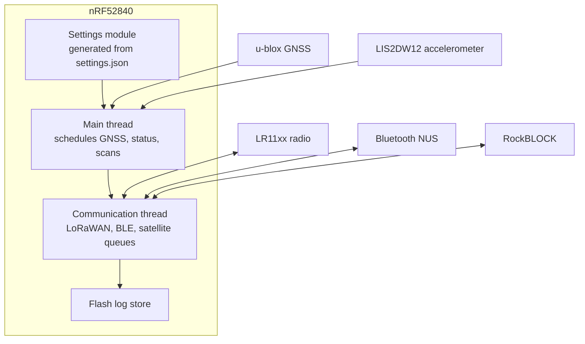

# Firmware

All OpenCollar Edge devices run one firmware: **OpenCollar Edge firmware**, developed by Smart Parks and IRNAS on the Nordic nRF Connect SDK (Zephyr RTOS) for the nRF52840. The same code base is built for every supported board and hardware revision group, and a *tracker type* setting selects device-specific behaviour and the image shown in the apps.

| | |
|---|---|
| **Latest release** | {{ latest_release('smartparks-opencollar-edge-fw-public') }} |
| **Public repository** | {{ repo_link('smartparks-opencollar-edge-fw-public') }} (MPL-2.0) |
| **Development repository** | {{ repo_link('smartparks-opencollar-edge-fw') }} (private; releases are mirrored to the public repository) |
| **SDK** | nRF Connect SDK 2.2 (Zephyr 3.2), MCUboot |
| **Radio** | Semtech LR11xx (LoRaWAN, GNSS scanning, Wi-Fi scanning), Nordic BLE |

## What the firmware does

- **Positioning** with a u-blox GNSS receiver (high accuracy, higher power) and the LR11xx GNSS scanner (lower power, needs a cloud solver), Wi-Fi and BLE scans as alternatives, motion-triggered fixes and configurable intervals.
- **Communication** over LoRaWAN (OTAA, all regions), Bluetooth (Nordic UART Service for configuration, logs and DFU), optional Iridium via RockBLOCK, and the experimental LP0 mode for LoRa without a LoRaWAN stack.
- **Sensors** LIS2DW12 accelerometer with motion detection, temperature, reed switch, external switch, electric fence probe, microphones and an optional air-quality board.
- **Storage** of every message in external flash, readable over LoRaWAN or Bluetooth.
- **Settings** defined once in `settings.json` and generated into C, with 123 settings, 46 commands and 20 readable values in version 8.0.1.

## Architecture in one picture

## Versions

Releases follow semantic versioning with a Keep a Changelog `CHANGELOG.md`. Milestones:

| Version | Date | Notes |
|---|---|---|
| 2.x | 2022 | First shared platform for RangerEdge, RhinoEdge and RhinoPuck |
| 4.0.0 | 2023-03 | Port to nRF Connect SDK 2.2 |
| 5.0.1 | 2024-03 | Non-functional migration image required between 4.x and 6.x |
| 6.x | 2024-02 to 2025-09 | CMDQ, external switch, LR messaging, CollarEdge and FreeEdge boards |
| 7.1.0 to 7.3.0 | 2026-02 to 2026-04 | RF scanner removed, LP0, SD card writer, public release workflow |
| 8.0.0 | 2026-09 | Settings family byte (new settings wire and storage format), BLE scan filters, persistent LoRa join session |

See [Releases](releases.md) for downloads and [Supported hardware](supported-hardware.md) for the board and revision table.

## Documentation in the firmware repository

The repository README covers setup with `east` and `west`, building per board and revision, build types (production, debug, provisioning), flashing, RTT logging, release creation and manual provisioning. Module READMEs describe settings, LP0, GNSS, satellite, sensors, the fence port and the operation tests. Start at the [README](https://github.com/SmartParksOrg/smartparks-opencollar-edge-fw-public#readme) and the [CHANGELOG](https://github.com/SmartParksOrg/smartparks-opencollar-edge-fw-public/blob/main/CHANGELOG.md).
