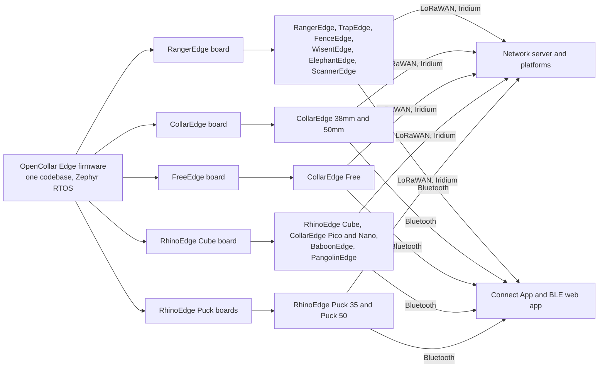

# OpenCollar

**Open-source wildlife tracking technology by [Smart Parks](https://www.smartparks.org/opencollar-io/).**

OpenCollar is a family of GPS and LoRaWAN trackers for animals, vehicles, rangers, fences and traps. One shared firmware runs on a handful of electronics boards that are packaged into collars, horn implants and rugged enclosures. Hardware designs, firmware, decoders and tools are published on GitHub. This site is the entry point that ties them together.

-   :material-bluetooth:{ .lg .middle } **Configure your OpenCollar**

    ---

    Connect over Bluetooth from a laptop or Android phone and change settings, send commands or read logs.

    [:octicons-arrow-right-24: Configure](tools/configure.md)

-   :material-update:{ .lg .middle } **Update firmware**

    ---

    Latest firmware: {{ latest_release('smartparks-opencollar-edge-fw-public') }}. Install it over Bluetooth with the web app or the Connect App.

    [:octicons-arrow-right-24: Update](tools/update-firmware.md)

-   :material-file-chart:{ .lg .middle } **Decode logs and payloads**

    ---

    Turn raw log files and LoRaWAN uplinks into positions, status and sensor data.

    [:octicons-arrow-right-24: Decode](tools/decode-logs.md)

-   :material-devices:{ .lg .middle } **Find your device**

    ---

    RangerEdge, CollarEdge, RhinoEdge and the experimental trackers, with specifications and repositories.

    [:octicons-arrow-right-24: Devices](devices/index.md)

## How it fits together

- **Devices** are the products: which board they use, what they measure, how long they run. See [Devices](devices/index.md).
- **Firmware** is shared by every device and released on GitHub with binaries, a settings schema and a payload decoder. See [Firmware](firmware/index.md).
- **Tools** let you configure, update and read devices without writing code. See [Tools](tools/index.md).
- **Protocols** describe what goes over LoRaWAN, Bluetooth and satellite. See [Protocols](protocols/index.md).
- **Hardware** covers the electronics and mechanics sources for building or modifying devices. See [Hardware](hardware/index.md).

## Status of this site

This site was created in September 2026 as the canonical index of the OpenCollar ecosystem. Device specifications, repository links and release information are generated from data files in the [opencollar repository](https://github.com/SmartParksOrg/opencollar). Field procedures and datasheets continue to live on the [Smart Parks Wiki](https://wiki.smartparks.org/devices/opencollar) until they are migrated. Release information was last synchronised on {{ releases_generated_at }}.
